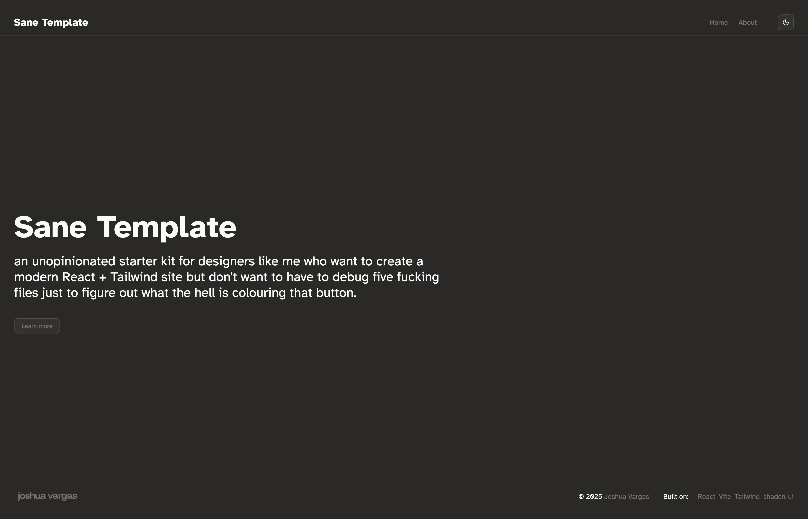

# Sane Template



a minimalist starter kit for designers like me who want to create a modern React + Tailwind site but don't want to have to debug five fucking files just to figure out what the hell is colouring that button.

- Minimalist architecture
- Global styles handled in one place (`index.css`), with Tailwind used directly in components — no scattered theme files or cryptic utility wrappers
- Root styling that won't fight against what you want to do at the page level

## Changelog

| Date       | Name         | Remarks                                 |
|------------|--------------|-----------------------------------------|
| 2025-12-16 | Jojo Vargas  | Improved mobile menu and overall cleaner |
| 2025-06-26 | Jojo Vargas  | It has come to my attention that Sanity is a content management / delivery platform, so I renamed this project |
| 2025-06-25 | Jojo Vargas  | Initial project setup and documentation |

## About

This is a blank canvas for you to create your layouts.

It’s relatively unencumbered, so you can be as flexible as you need to be. Edit global styles in `index.css` (including colours, hyperlink hover interactions, etc.) and style components or one-off elements using Tailwind utility classes.

### Features

- 🌗 Dark mode toggle (via `@shadcn/ui`)
- 📱 Mobile-responsive navbar with sliding sheet menu
- 🎨 Easy-to-edit theme with OKLCH color definitions
- 🧼 Clean file structure with no opinionated folder hell
- 🔨 shadcn-ui components, functional and highly customisable

### Notes

- The header is positioned `absolute` and will **overlap** your content — so don’t forget to offset your first `div` accordingly (e.g., with `mt-30`).
- There are comments throughout the codebase to help you navigate and tweak things easily.
- Built with React Router, Tailwind, and ShadCN — but you can easily swap parts out.

### Getting Started

#### 1. Install Node.js and Yarn

If you haven’t already, install [Node.js](https://nodejs.org/) (recommended: LTS version).

Then install Yarn globally:

```bash
npm install --global yarn
```

#### 2. Clone the repository
Follow the instructions on GitHub to clone this repository.

#### 3. Install dependencies

On your terminal, run this:

```bash
yarn install
```

#### 4. Start the development server

You can start the development server using:
```bash
yarn dev
```

Head to [http://localhost:5173](http://localhost:5173) — this is Vite’s default dev server address, but yours may vary.

---

### Accessibility

Basic accessibility is supported out of the box via semantic HTML and [shadcn/ui](https://ui.shadcn.dev)'s focus-visible patterns. ARIA labels are included in interactive elements like the menu trigger. Further improvements (e.g., keyboard navigation across the sheet menu) are welcome contributions!

---

If you have any questions or bug reports, please feel free to raise an issue or reach out to me through the links on my profile.

⚠️ This is sort of my first time creating a derivative of a webdev project into a shareable artefact, so I would appreciate any feedback and advice!

---

With love,  
**Jojo Vargas**  
Urban tech researcher at ETH Zurich  
With a hatred of overengineered boilerplates  
And a desire to style everything manually